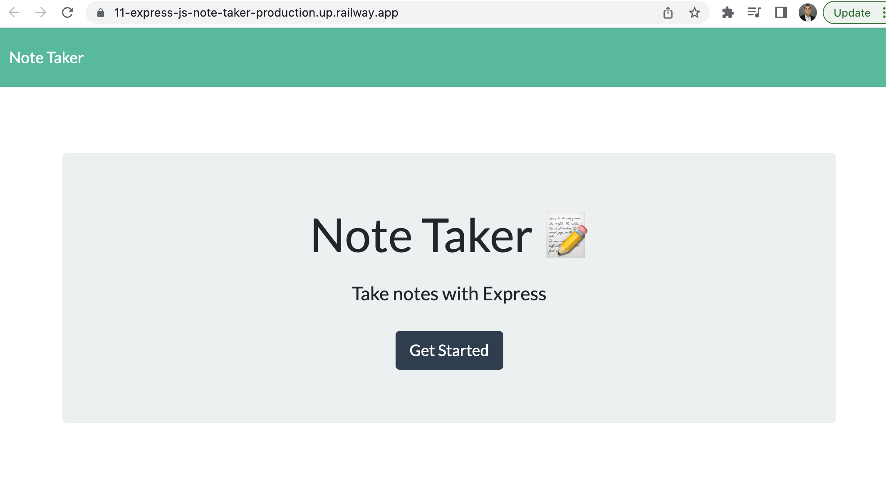
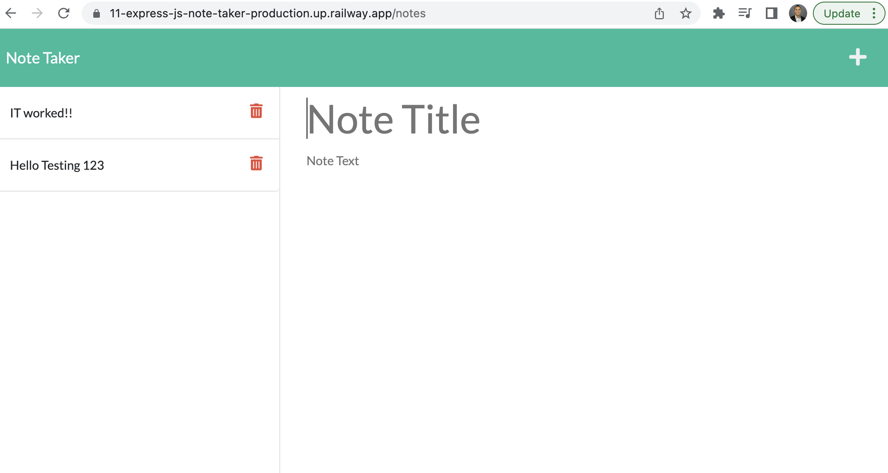

# 11 Express.js: Note Taker						
## Description
A client has reached out to me about building a note taker application that can be used to save and write notes. As a developer, I have several ways I can approach this project, so I decided on using Express.js back end. From there, it will save and retrieve note data from a JSON file. Lastly, I will deploy it on railway.app. 

 

## Table of Contents 
- [Installation](#installation)
- [Usage](#usage)
- [License](#license)

## Installation
This code does not require any installation. It can be run locally on a server or you can simply click the URL for the finished product deployed on Railway.app.

## Usage
The following GitHub repo url is:
https://github.com/tarekmn/11-express-js-note-taker

The following deployed url (railway.app) is:
https://11-express-js-note-taker-production.up.railway.app/

In addition, I included a screenshot of the depoloyed site: 

 

## License
MIT License

Copyright (c) 2022 Tarek Menesi

Permission is hereby granted, free of charge, to any person obtaining a copy
of this software and associated documentation files (the "Software"), to deal
in the Software without restriction, including without limitation the rights
to use, copy, modify, merge, publish, distribute, sublicense, and/or sell
copies of the Software, and to permit persons to whom the Software is
furnished to do so, subject to the following conditions:

The above copyright notice and this permission notice shall be included in all
copies or substantial portions of the Software.

THE SOFTWARE IS PROVIDED "AS IS", WITHOUT WARRANTY OF ANY KIND, EXPRESS OR
IMPLIED, INCLUDING BUT NOT LIMITED TO THE WARRANTIES OF MERCHANTABILITY,
FITNESS FOR A PARTICULAR PURPOSE AND NONINFRINGEMENT. IN NO EVENT SHALL THE
AUTHORS OR COPYRIGHT HOLDERS BE LIABLE FOR ANY CLAIM, DAMAGES OR OTHER
LIABILITY, WHETHER IN AN ACTION OF CONTRACT, TORT OR OTHERWISE, ARISING FROM,
OUT OF OR IN CONNECTION WITH THE SOFTWARE OR THE USE OR OTHER DEALINGS IN THE
SOFTWARE.
